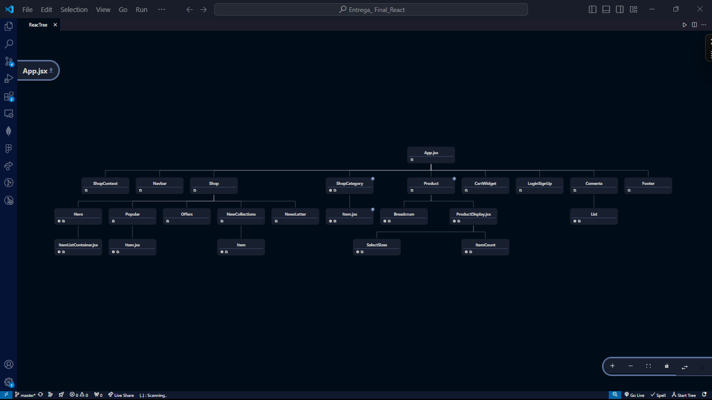

# E-commmerce React - entrega final 

#### Dev - Harold Díaz

##### Imagen de la estructura de la entrega final

## Anotaciones:

Este proyecto se trata de un ecommerce de ropa con 3 categorías diferentes; hombres, mujeres y niños. Se venía desarrollando del módulo anterior y lo he estado mejorando y personalizando. Lo fuí conformando de varios tutoriales y lo he estado adaptando según las clases que vimos en la cursada.

Posterior a la entrega pasada, agregué varias funcionalidades que se vieron en las últimas clases, como las de escribir, leer, eliminar y actualizar en una base de datos no relacional. en mi caso, solo conocía mongoDB y tuve varias dificultades para poder renderizar los productos desde la colección creada en mi Firebase. Por lo tanto, fuí adaptándome a los escenarios y agregué componentes según el caso, como Comenta.jsx por ejemplo, para poder demostrar la funcionalidad e interactividad con una base de datos. En este segmento para manejar la data sensible como la contraseña de la base de datos me apoyé en el uso del enmascaramiento usando la variable de entorno.

Aparte, simulo con un botón (Ingresa) un apartado de registro de usuario donde se encuentra la estructura de un formulario desde el cual me hubiese gustado poder guardar la data ingresada en una variable de entorno usando el localStorage pero por la falta de tiempo no pude agregarlo. Hubo una de las clases vistas (servidores) donde me quedé estancado con lo del servidor local. al final no pude y me retrasé un poco, pero mas que nada con ése y otros ejercicios que nunca había hecho antes (igual lo dejé en pendiente)

En el componente CartWidget se encuentra un ternario que muestra un gif si no hay productos en el carrito con su mensaje respectivo y si, "si", hay productos en él.. se muestra entonces solamente la cantidad de items ya que no pude de las mil quinientas formas que intenté renderizar el resto de parámetros de cada objeto.

Al final revisé un poco mas y creo que pudo haber funcionado con la lectura de sub-colecciones en el firebase, con ese método quizá pude haber obtenido renderizar toda la data pero no me dió tiempo si no de mostrar la data pon consola. Ahora, de igual forma realicé otra lectura de la colección "comentarios" que tengo en mongoDB con la que se hace todo lo que se refiere a operaciones CRUD. con mongoDB se me hace mucho mas sencillo, pero en resumen practicaré mas con Firebase. se hace mas compleja para mi práctica y disponibilidad de tiempo actual.

## Dependencias usadas en el proyecto;

Dependencias (dependencies):

`axios`
`express`
`firebase`
`mongoose`
`react`
`react-dom`
`react-icons`
`react-router-dom`
`react-toastify`

## Dependencias de desarrollo (devDependencies):

`@babel/core`
`@babel/preset-env`
`@babel/preset-react`
`@types/react`
`@types/react-dom`
`@vitejs/plugin-react`
`eslint`
`eslint-plugin-react`
`eslint-plugin-react-hooks`
`eslint-plugin-react-refresh`
`nodemon`
`vite`

A continuación, se muestra las instrucciones a seguir para correr la página en conjunto con la base de datos

## Notas de entrega:

- Para el filtrado se está usando las categorías Hombres, Mujeres y Niños para renderizar la información entre componentes y rutas.
- Luego agregamos al botón "Explore mas" la función (getAllProducts) que agrega una fila adicional de productos al DOM de imágenes para dar uso a la función.
- Luego agregué una sección de comentarios para hacer uso de las operaciones CRUD. Con esta sección se guardan datos en una colección de Mongodb llamada products. Se pueden editar, borrar y actualizar los comentarios.
- Continuamos con el ruteo dinámico entre los enlaces y los catálogos de fotos.
- También se agregó un componente BreadCrumb para jugar con las conexiones entre los id y las imágenes.
- Para agregar muestra visual adjunté una imagen del árbol de la app para entender su estructura y como va hasta ahora.

El comando para correr el servidor desde la carpeta backend es:

`(npm run dev)`

> backend@1.0.0 dev
> nodemon Server.js

[nodemon] 3.1.0
[nodemon] to restart at any time, enter `rs`
[nodemon] watching path(s): _._
[nodemon] watching extensions: js,mjs,cjs,json
[nodemon] starting `node server.js`
Servidor iniciado en el puerto 5000
mongoDB está conectado...

/////////////////////////////////////////////////////////////

Luego, tenemos el comando para correr la página, que es:

`(npm run dev)`

> entrega_final_react@0.0.0 dev
> vite

VITE v5.2.12 ready in 227 ms

➜ Local: http://localhost:5173/
➜ Network: use --host to expose
➜ press h + enter to show help

///////////////////////////////////////////////////////////
